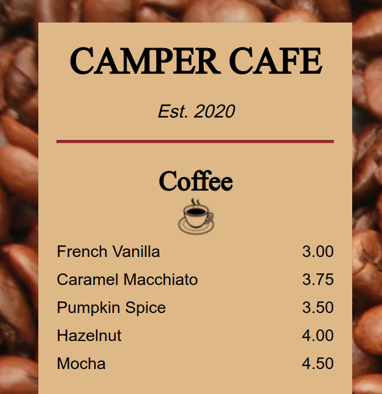
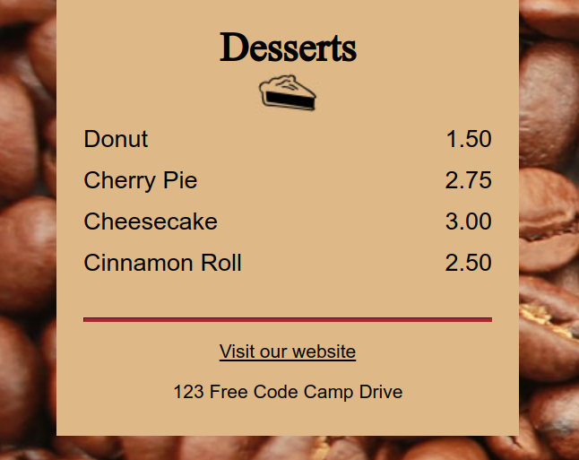

# Cafe-Menu-Template

A Flawless [Cafe Menu](https://www.freecodecamp.org/learn/2022/responsive-web-design/#learn-basic-css-by-building-a-cafe-menu) Built with CSS From [FreeCodeCamp Responsive Course](https://www.freecodecamp.org/learn/2022/responsive-web-design/#learn-basic-css-by-building-a-cafe-menu)

# Table Of Contents

* [Notice](#notice) - Notice From Yu14 Ywen
* [Documentations](#documentations) - DOcumentations for this repo
* [Screenshots](#screenshots) - Screenshots to show this Website
  

# Notice

**Please do not use this material to cheat on your school project or any sort related to education.** it is best if you learn and read resources so u will understand everything. Think of this as a template and take insp. Although, There are no restrictions that suspends you from forking it and using it for your own purposes.

[Back to Top](#table-of-contents)

# Documentations

[Visit the website](https://yu14y.github.io/Cafe-Menu-Template/)

Reminder, this is the 2022 course. i will not update to future courses. A flawless cafe Menu is from Freecodecamp Responsive Web Design Course. This Repo was created to showcase the website. I will not be explaining any html elements or any css code as i believe users may use this repo to finish the course quickly. I wish that you read all the resources first, so u will understand everything better and understand every part of it. This Repo was created since [Yu14 Ywen (the Owner of this Repo)](https://github.com/Yu14Y) was taking the course on Freecodecamp. I wish to remind you that. Everything in the index.html & styles.css file was the output of the course.

this is a simple menu built with css and html. You can view the item and prices of it. There is a website at the bottom in which you can visit. This course is to better help understand css

I will not be merging any PR related to index.html or styles.css but other PR that will improve the readme will be merged.

[Back to Top](#table-of-contents)

# Screenshots

[Back to Top](#table-of-contents)
